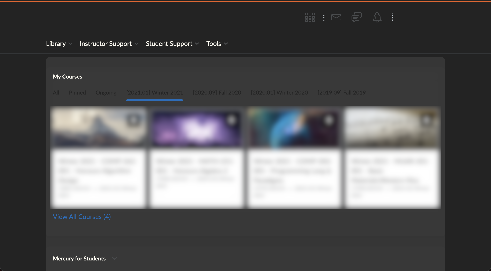

# Dark Mode for MyCourses

MyCourses Dark Mode for a better experience :). Some website text may be illegible due to the color scheme, so use at your own risk. The code has no affiliation to McGill University and no intention to circumvent the Policy on the Responsible Use of McGill Information. If it is the case that it unintentionally does, please inform me and I will gladly take it down.
Code shared under CC BY-NC-SA - Creative Commons Attribution-NonCommercial-ShareAlike.

## Installation
1. Install [Stylus](https://github.com/openstyles/stylus/), a web browser extension used to modify a page's css. Chrome extension found [here](https://chrome.google.com/webstore/detail/stylus/clngdbkpkpeebahjckkjfobafhncgmne), Firefox extension [here](https://addons.mozilla.org/en-US/firefox/addon/styl-us/), Opera extension [here](https://addons.opera.com/en/extensions/details/stylus/).

### Easy  way:
1. Navigate to [the style download page.](https://userstyles.org/styles/195608/mycourses-dark-mode-beta) and click on *Install Style*.

OR

1. Navigate to MyCourses webpage and login.
2. Click on the Stylus extension icon and then on *Find styles*.
3. Click on *MyCourses Dark Mode (Beta)* and it automatically installs into Stylus.

### Other  way:
1. Click on Stylus extension icon then on *Manage*.
2. Click *Write new style* to create a new style.
3. Copy the *darkMode.css* text into the code section.
4. Click the plus icon next to *Applies to* near the bottom of the screen and change to *URLs on the domain mycourses2.mcgill.ca*
5. Name the style whatever you want and save it.

## Preview

---
Enjoy! I'll try to improve it throughout the semester, so look out for updates (available on the Stylus Manage page).
